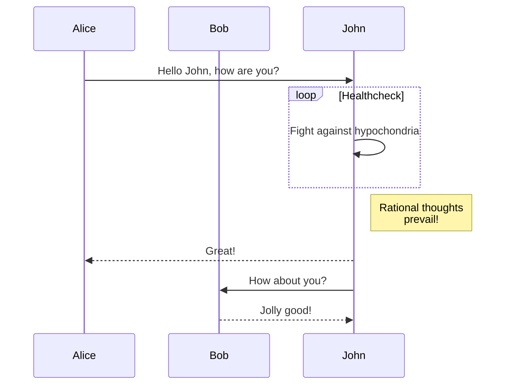
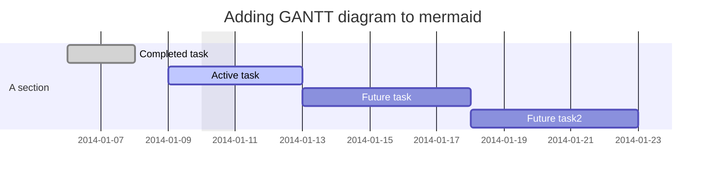
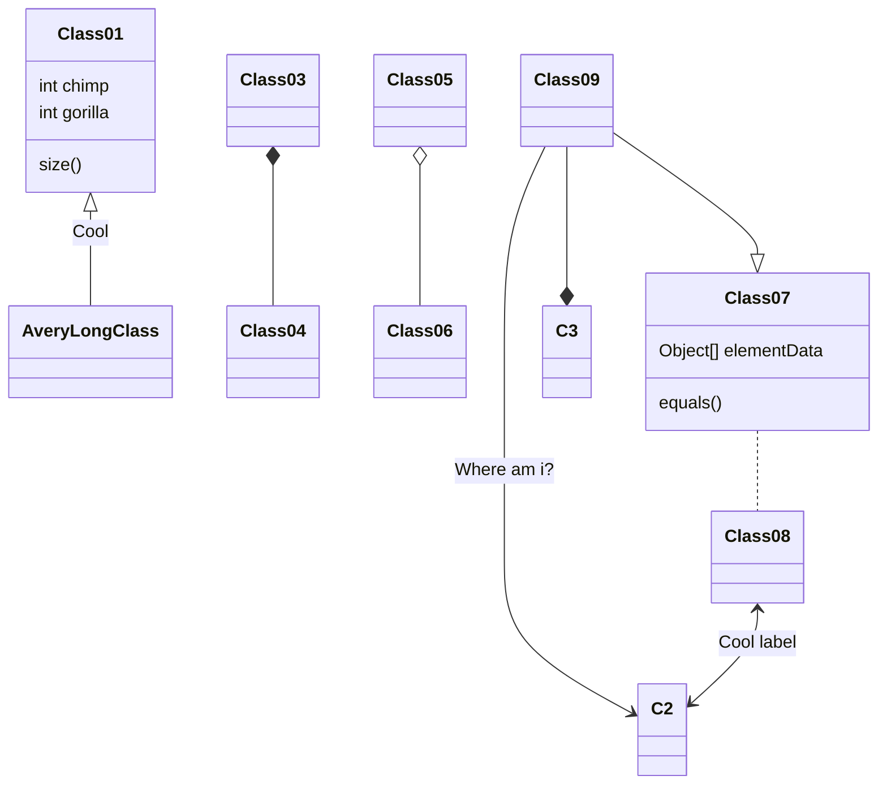
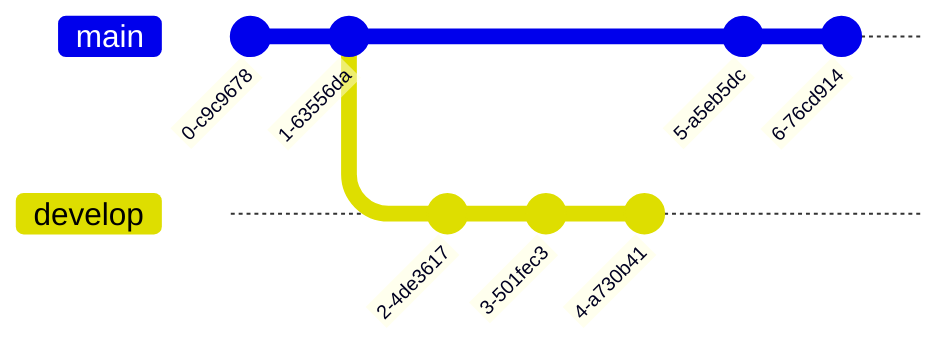
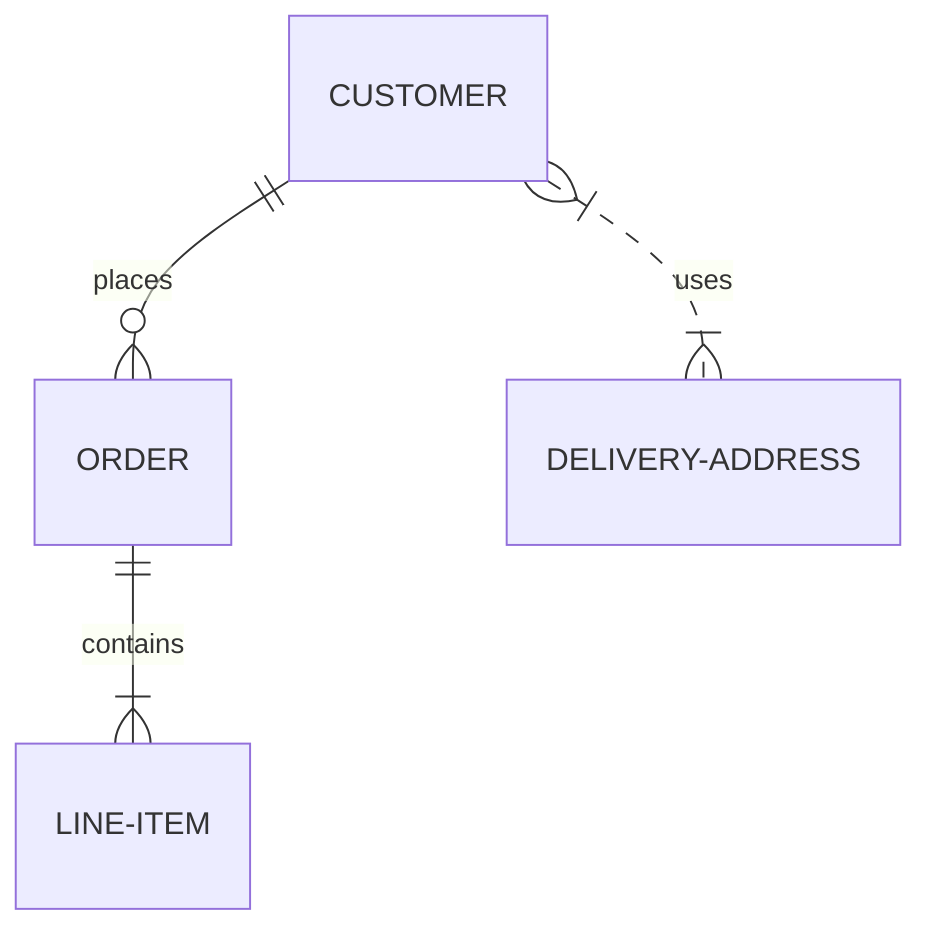
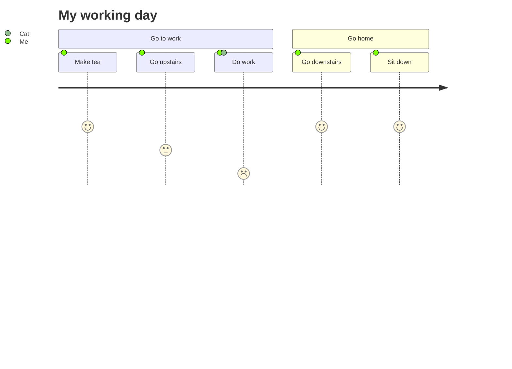

Markdown Cheatsheet<a name="TOP"></a>
===================

- - - - 
# Heading 1 #

    Markup :  # Heading 1 #

    -OR-

    Markup :  ============= (below H1 text)

## Heading 2 ##

    Markup :  ## Heading 2 ##

    -OR-

    Markup: --------------- (below H2 text)

### Heading 3 ###

    Markup :  ### Heading 3 ###

#### Heading 4 ####

    Markup :  #### Heading 4 ####


Common text

    Markup :  Common text

_Emphasized text_

    Markup :  _Emphasized text_ or *Emphasized text*

~~Strikethrough text~~

    Markup :  ~~Strikethrough text~~

__Strong text__

    Markup :  __Strong text__ or **Strong text**

___Strong emphasized text___

    Markup :  ___Strong emphasized text___ or ***Strong emphasized text***

[Named Link](http://www.google.fr/ "Named link title") and http://www.google.fr/ or <http://example.com/>

    Markup :  [Named Link](http://www.google.fr/ "Named link title") and http://www.google.fr/ or <http://example.com/>

[heading-1](#heading-1 "Goto heading-1")
    
    Markup: [heading-1](#heading-1 "Goto heading-1")

Table, like this one :

First Header  | Second Header
------------- | -------------
Content Cell  | Content Cell
Content Cell  | Content Cell

```
First Header  | Second Header
------------- | -------------
Content Cell  | Content Cell
Content Cell  | Content Cell
```

Adding a pipe `|` in a cell :

First Header  | Second Header
------------- | -------------
Content Cell  | Content Cell
Content Cell  | \|

```
First Header  | Second Header
------------- | -------------
Content Cell  | Content Cell
Content Cell  |  \| 
```

Left, right and center aligned table

Left aligned Header | Right aligned Header | Center aligned Header
| :--- | ---: | :---:
Content Cell  | Content Cell | Content Cell
Content Cell  | Content Cell | Content Cell

```
Left aligned Header | Right aligned Header | Center aligned Header
| :--- | ---: | :---:
Content Cell  | Content Cell | Content Cell
Content Cell  | Content Cell | Content Cell
```
|                |ASCII                          |HTML                         |
|----------------|-------------------------------|-----------------------------|
|Single backticks|`'Isn't this fun?'`            |'Isn't this fun?'            |
|Quotes          |`"Isn't this fun?"`            |"Isn't this fun?"            |
|Dashes          |`-- is en-dash, --- is em-dash`|-- is en-dash, --- is em-dash|


`code()`

    Markup :  `code()`

```javascript
    var specificLanguage_code = 
    {
        "data": {
            "lookedUpPlatform": 1,
            "query": "Kasabian+Test+Transmission",
            "lookedUpItem": {
                "name": "Test Transmission",
                "artist": "Kasabian",
                "album": "Kasabian",
                "picture": null,
                "link": "http://open.spotify.com/track/5jhJur5n4fasblLSCOcrTp"
            }
        }
    }
```

    Markup : ```javascript
             ```

* Bullet list
    * Nested bullet
        * Sub-nested bullet etc
* Bullet list item 2

~~~
 Markup : * Bullet list
              * Nested bullet
                  * Sub-nested bullet etc
          * Bullet list item 2

-OR-

 Markup : - Bullet list
              - Nested bullet
                  - Sub-nested bullet etc
          - Bullet list item 2 
~~~

1. A numbered list
    1. A nested numbered list
    2. Which is numbered
2. Which is numbered

~~~
 Markup : 1. A numbered list
              1. A nested numbered list
              2. Which is numbered
          2. Which is numbered
~~~

- [ ] An uncompleted task
- [x] A completed task

~~~
 Markup : - [ ] An uncompleted task
          - [x] A completed task
~~~

- [ ] An uncompleted task
    - [ ] A subtask

~~~
 Markup : - [ ] An uncompleted task
              - [ ] A subtask
~~~

> Blockquote
>> Nested blockquote

    Markup :  > Blockquote
              >> Nested Blockquote

_Horizontal line :_
- - - -

    Markup :  - - - -

_Image with alt :_


    Markup : 

Foldable text:

<details>
  <summary>Title 1</summary>
  <p>Content 1 Content 1 Content 1 Content 1 Content 1</p>
</details>
<details>
  <summary>Title 2</summary>
  <p>Content 2 Content 2 Content 2 Content 2 Content 2</p>
</details>

    Markup : <details>
               <summary>Title 1</summary>
               <p>Content 1 Content 1 Content 1 Content 1 Content 1</p>
             </details>

```html
<h3>HTML</h3>
<p> Some HTML code here </p>
```

Link to a specific part of the page:

[Go To TOP](#TOP)
   
    Markup : [text goes here](#section_name)
              section_title<a name="section_name"></a>    

Hotkey:

<kbd>⌘F</kbd>

<kbd>⇧⌘F</kbd>

    Markup : <kbd>⌘F</kbd>

Hotkey list:

| Key | Symbol |
| --- | --- |
| Option | ⌥ |
| Control | ⌃ |
| Command | ⌘ |
| Shift | ⇧ |
| Caps Lock | ⇪ |
| Tab | ⇥ |
| Esc | ⎋ |
| Power | ⌽ |
| Return | ↩ |
| Delete | ⌫ |
| Up | ↑ |
| Down | ↓ |
| Left | ← |
| Right | → |

Emoji:

:exclamation: Use emoji icons to enhance text. :+1:  Look up emoji codes at [emoji-cheat-sheet.com](http://emoji-cheat-sheet.com/)

    Markup : Code appears between colons :EMOJICODE:


Footnotes
---------------------------

Some text with a footnote.[^1]

[^1]: The footnote.

## KaTeX

[KaTeX](https://khan.github.io/KaTeX/):

The *Gamma function* satisfying $\Gamma(n) = (n-1)!\quad\forall n\in\mathbb N$ is via the Euler integral

$$
\Gamma(z) = \int_0^\infty t^{z-1}e^{-t}dt\,.
$$

> You can find more information about **LaTeX** mathematical expressions [here](http://meta.math.stackexchange.com/questions/5020/mathjax-basic-tutorial-and-quick-reference).


# UML diagrams
[Mermaid](https://mermaidjs.github.io/)
## Flowchart

## Sequence diagram

Gantt diagram

## ClassDiagram

## GitGraph

## erDiagram

## Journey
