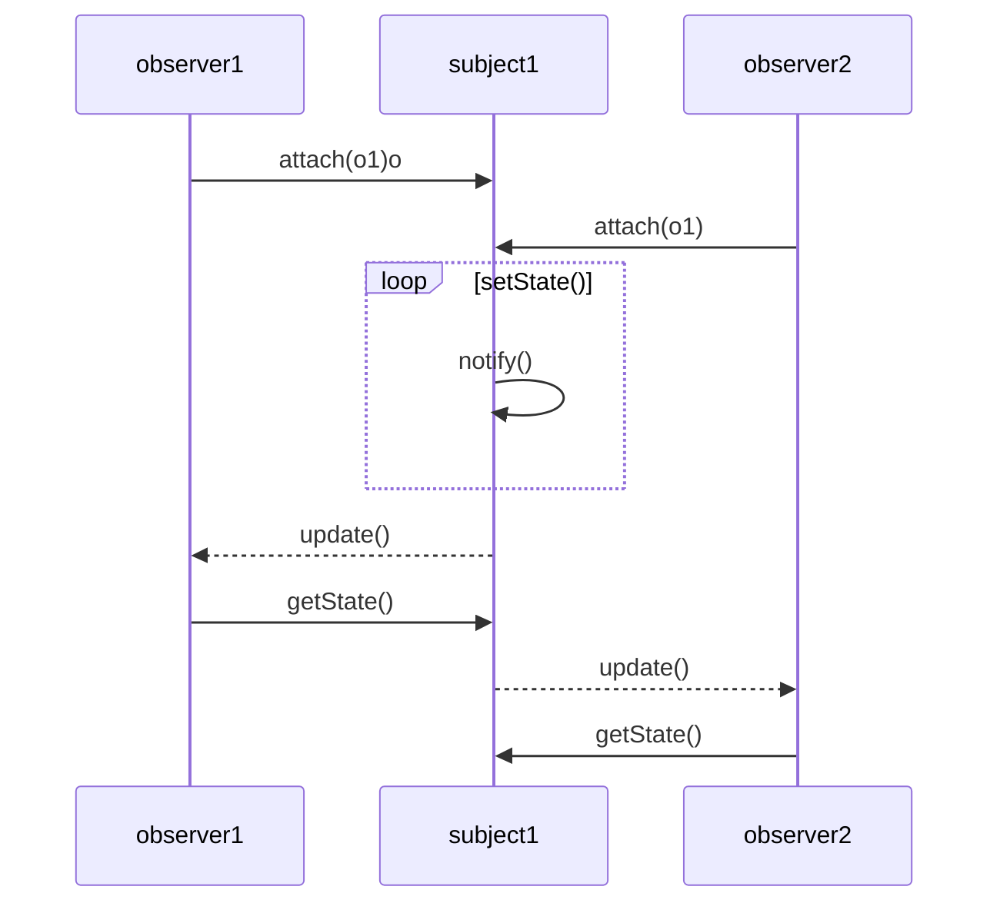

# 옵저버 패턴(observer pattern)

### Diagram

### 설명
옵저버 패턴(observer pattern)은 주체가 어떤 객체(subject)의 상태 변화를 관찰하다가 상태 변화가 있을 때마다 메서드 등을 통해 옵저버 목록에 있는 옵저버들에게 변화를 알려주는 디자인 패턴입니다.
여기서 주체란 객체의 상태 변화를 보고 있는 관찰자이며, 옵저버들이란 이 객체의 상태 변화에 따라 전달되는 메서드 등을 기반으로 ‘추가 변화 사항’이 생기는 객체들을 의미합니다.

<!-- 
The observer pattern is a software design pattern in which an object, called the subject, maintains a list of its dependents, called observers, and notifies them automatically of any state changes, usually by calling one of their methods.

It is mainly used to implement distributed event handling systems, in "event driven" software. Most modern languages such as C# have built-in "event" constructs which implement the observer pattern components.

The observer pattern is also a key part in the familiar model–view–controller (MVC) architectural pattern. The observer pattern is implemented in numerous programming libraries and systems, including almost all GUI toolkits.
 -->
### 사용처


### 단점


### 샘플  코드
```dart
class Notification {
  String message;
  DateTime timestamp;
  Notification(this.message, this.timestamp);
  Notification.forNow(this.message) {
    timestamp = new DateTime.now();
  }
}

class Observable {
  List<Observer> _observers;

  Observable([List<Observer> observers]) {
    _observers = observers ?? [];
  }

  void registerObserver(Observer observer) {
    _observers.add(observer);
  }

  void notify_observers(Notification notification) {
    for (var observer in _observers) {
      observer.notify(notification);
    }
  }
}

class Observer {
  String name;
  
  Observer(this.name);

  void notify(Notification notification) {
    print("[${notification.timestamp.toIso8601String()}] Hey $name, ${notification.message}!");
  }
}

class CoffeeMaker extends Observable {
  CoffeeMaker([List<Observer> observers]) : super(observers);
  void brew() {
    print("Brewing the coffee...");
    notify_observers(Notification.forNow("coffee's done"));
  }
}

void main() {
  var me = Observer("Tyler");
  var mrCoffee = CoffeeMaker(List.from([me]));
  var myWife = Observer("Kate");
  mrCoffee.registerObserver(myWife);
  mrCoffee.brew();
  /*
    Brewing the coffee...
    [2019-06-18T07:30:04.397518] Hey Tyler, coffee's done!
    [2019-06-18T07:30:04.397518] Hey Kate, coffee's done!
  */
}
```